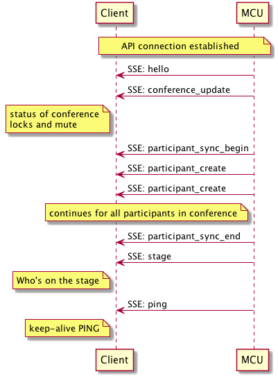

---
---
# Basic Concepts

The following sequence diagrams outline the high level call flow
involved in setting up a connection to the Pexip service.  The
`Client` is your application making HTTP requests and the `MCU` is a
Pexip worker node in your deployment.  Worker nodes are normally
discovered using DNS SRV for a specific domain.

If you're using PexRTC in a Cordova app, most of these details will be
hidden away from you but it's very useful to have a proper
understanding of what's going on under the covers to help you debug.
If you're implementing a native app, this is essential.

## Getting Access to the Conference {#gettingaccess}

This call flow shows just the basic API participant flow.  An API
participant has no media associated with it but is a fully fledged
participant that can control the conference, receive events, view the
roster list, send and receive chat messages and also send / receive
presentations.  When developing your application it is important to
get this call flow working reliably as it forms the basis for all
communications with the MCU.

The token you receive must be used for all subsequent transactions
with the MCU and it must be refreshed (the expiry time will be given
to you).  If you fail to provide a token or provide a token that is
invalid or expired that request will fail and once the original
request expires, your participant will be ejected from the conference.

If your conferencing worker nodes are behind some form of proxy
e.g. a reverse proxy for load balancing you may need to deal with HTTP
authentication challenges and or SSL certificate challenges.

Documentation for the client control requests can be found [here](https://docs.pexip.com/api_client/api_rest.htm#client_summary)

To discover the service via DNS SRV
(see
[pexip DNS docs](https://docs.pexip.com/admin/dns_records.htm#connect)
for setup details), you should take the conference URI from the user
in the form of `conference@domain.org` and extract the domain and
conference parts.  Perform a look up for `_pexapp._tcp.domain.org` to
see if there are any SRV records available for `domain.org`.  If there
are none, you should just use the domains `A` record entry.

Once finished with your connection, you must perform the
`release_token` request so the MCU can clear down any resources taken
by your client and potentially end the conference.  If you do not
release your token, the MCU will maintain the participant in the
roster list until the token expires.

### Requesting a token

The token request is the very first contact you make with the client
API and determines all further actions.  See
[request_token](https://docs.pexip.com/api_client/api_rest.htm#request_token) for full
details.  You will need to make sure that any services (VMRs, Gateway rules)
configured on your deployment have aliases that match what you are
dialing or you will receive a not found response.  The
`request_token` exchange is also where you will deal with any PINs
that may have been configured on the services or supply conference
extensions for Virtual Reception Rooms.  See the *PIN protected
conferences* and *Virtual Receptions* section of the above
`request_token` documentation.

### Understanding your token

The token provides a large amount of information about the service you
are connecting to.  The response to a successful `request_token`
should be parsed out to provide the correct feedback to the user.  At
a minimum you should store the `token` string to use in headers for
all subsequent requests, the `participant_uuid` as this is needed in later
operations, your `role` as this will determine what you can and can't
do in a conference and your `service_type` as this determines what
type of conference you are in or if you are in a waiting room.

### Subscribing to the event stream

Once you have a token you must subscribe to the event stream in order
to receive further updates about the conference.  See
[SSE](https://docs.pexip.com/api_client/api_rest.htm#server_sent) docs.  Once
subscribed, you will receive an initial burst of events.  You can use your own implementation of the
W3C [SSE spec](https://www.w3.org/TR/2011/WD-eventsource-20111020/) or
use a readily available off-the-shelf version.

#### Initial SSE flow when first connecting

When you first connect the event source, the MCU will send you a set
of events so you can correctly display the initial list of
participants in the roster and prepare yourself.  The full list of events
can be seen
[here](https://docs.pexip.com/api_client/api_rest.htm#server_summary)

The initial participant sync is useful for creating the roster list of
participants in your application and only happens on connection.
Stage updates show you who is currently "on the stage" i.e. visible in
the main window.  You can find out who is talking by looking at the
information in the participant update messages.

#### Dealing with subsequent SSEs

A full list of SSEs located [here](https://docs.pexip.com/api_client/api_rest.htm#server_summary) and
should be dealt with accordingly e.g. on a `participant_create`
message, you should add a participant into the roster and potentially
display this information to the user.

### Refreshing a token

The `expires` field of the original `request_token` will give you a
time in seconds before the token expires.  We recommend refreshing
your token at an interval of `expires/2` seconds.
See
[refresh token](https://docs.pexip.com/api_client/api_rest.htm#refresh_token) docs
for full information.

### Releasing a token

This will disconnect you from the conference and clear any resources
used by your participant.  See
[release token](https://docs.pexip.com/api_client/api_rest.htm#release_token) docs for full details.

# Great, now what ?

Once you are an API participant, you can now perform other functions
like sending chat messages, sending and receiving presentations and
starting audio/video.  The following sections detail all of that
for you.  Head back [home](index#start) to carry on.
