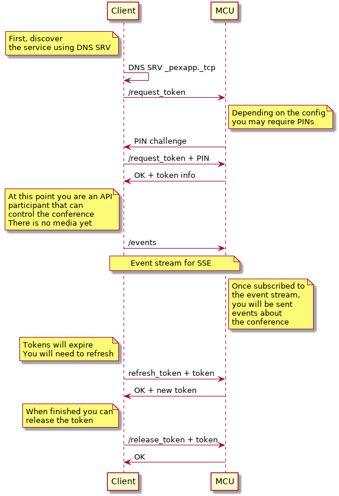

---
---
# Basic Concepts

The following sequence diagrams outline the high level call flow
involved in setting up a connection to the Pexip service.  The
`Client` is your application making HTTP requests and the `MCU` is a
Pexip worker node in your deployment.  Worker nodes are normally
discovered using DNS SRV for a specific domain.

## Getting Access to the Conference {#gettingaccess}

This call flow shows just the basic API participant flow.  An API
participant has no media associated with it but is a fully fledged
participant that can control the conference, receive events, view the
roster list, send and receive chat messages and also send / receive
presentations.  When developing your application it is important to
get this call flow working reliably as it forms the basis for all
communications with the MCU.

The token you receive must be used for all subsequent transactions
with the MCU and it must be refreshed (the expiry time will be given
to you).  If you fail to provide a token or provide a token that is
invalid or expired that request will fail and once the original
request expires, your participant will be ejected from the conference.

If your conferencing worker nodes are behind some form of proxy
e.g. a reverse proxy for load balancing you may need to deal with HTTP
authentication challenges and or SSL certificate challenges.

Documentation for the client control requests can be found [here](https://docs.pexip.com/api_client/api_rest.htm#client_summary)

To discover the service via DNS SRV
(see
[pexip DNS docs](https://docs.pexip.com/admin/dns_records.htm#connect)
for setup details), you should take the conference URI from the user
in the form of `conference@domain.org` and extract the domain and
conference parts.  Perform a look up for `_pexapp._tcp.domain.org` to
see if there are any SRV records available for `domain.org`.  If there
are none, you should just use the domains `A` record entry.

Once finished with your connection, you must perform the
`release_token` request so the MCU can clear down any resources taken
by your client and potentially end the conference.  If you do not
release your token, the MCU will maintain the participant in the
roster list until the token expires.
