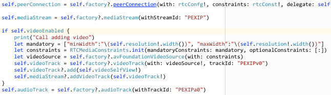
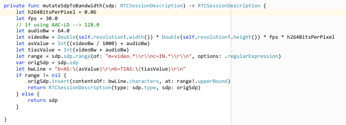

---
---
# iOS Media Establishment

This section follows on from the [high level flow](media) and
discusses how to create a media session using the WebRTC binary.  The
WebRTC implementation is changing rapidly so this document may not
reflect the latest changes -
please [let us know](mailto:ian@pexip.com) if this gets out of date.

## Initializing the RTCPeerConnection

The `RTCPeerConnection` object is the main interface to the WebRTC
library and is created using a factory.  First, we must first
initialize the SSL libraries underneath everything by running
`RTCInitializeSSL()`. Once we have that done, we can then create a
`RTCPeerConnectionFactory` object and build the component
parts to create our `RTCPeerConnection` object.

First we need an `RTCBundlePolicy` set with `maxCompat` so as not to
bundle all media over a single port and we'll also need to fill in any
ICE server configuration at this point e.g. if your TURN/ICE servers
need any authentication setup (see
[turn server](https://docs.pexip.com/admin/about_turn_server.htm) for more
information)
We can then set our media constraints to show if we're offering video
or audio or both and also set the `DtlsSrtpKeyAgreement` to true.
Once we have those, we can pass them into the factory to produce our
RTCPeerConnection object.  For iOS, this could look like:

## Building media streams from tracks

Once we have our `RTCPeerConnectionFactory`, we can also use it to
create our media streams and assign our audio and video tracks to
them.  For iOS we'll be using `AVFoundation` sources and using the
`avFoundationVideoSource`, `videoTrack` and `audioTrack` methods of
the `RTCPeerConnectionFactory`.  For iOS, this could look like:

## Creating the offer with ICE candidates

Creating the offer using the `RTCPeerConnection` object will trigger a
bunch of calls that must be handled by your delegate in particular:

 - RTCPeerConnection :: didChange newState RTCICEGatheringState

As this is what will return the final SDP back up to the application
so we can POST it to the MCU as our offer.  For iOS this could look like:

## Mangling the SDP to set bandwidths and resolutions

Before we POST the SDP to the MCU we must manipulate our SDP to set
the supported bandwidth and resolutions for the call e.g. make this a
wCIF call at 384kbps.  You could make this decision on behalf of your
user by looking at the connectivity of the device e.g. WiFi or
Cellular or through selection from user input e.g. "High Quality"
might convert to a 2Mbps call @720p.  Bear in mind that this is only
what is offered to the MCU, it might not actually end up being
negotiated and honored.  For more information, the reader is pointed
to [RFC4566](https://tools.ietf.org/html/rfc4566).  We can mangle the SDP once we
reach the `RTCICEGatheringState.complete` i.e. all the ICE candidates
have been discovered and added to the description and we only really
need to set the `AS` and `TIAS` setting for the total session
bandwidth and the RTC constraints for capture device to set the out bound
resolutions (`minWidth`).  For iOS, this could look like:

## Sending the SDP offer

Once we have a complete offer with all candidates and we have
manipulated the SDP to what we want we can now POST this to the MCU.  See [calls](https://docs.pexip.com/api_client/api_rest.htm#calls) documentation.

## Receiving the SDP answer

Once the MCU has calculated an answer for for our offer, it will send
back its response and we can then manipulate this further e.g. to
limit the out bound bandwidth from our device and then pass this into
our `RTCPeerConnection` objects `remoteDescription`. For iOS, this
could look like:

## Connecting streams

Once our `RTCPeerConnection` objects `remoteDescription` has been set
and accepted you can now connect up the incoming streams to your views
to display the video and play the sound when the delegate function fires:

 - RTCPeerConnection :: didAdd stream RTCMediaStream

In this event, you can pick out the audio and video streams and attach
them to your `RTCEAGLView` renderers i.e. the views you have setup to
show video in your app.  For iOS, this could look like:

## Starting media flow

Once the offer/answer dance has completed and you have wired up your
streams, you can know trigger the MCU into sending media by sending an
`ack` message:
See [ack](https://docs.pexip.com/api_client/api_rest.htm#ack)
documentation.  Once this completes, you should start to see and hear
media in your application.  Missing the `ack` **is a common mistake**
and will mean you don't see media flowing and can cause headaches
debugging what looks like valid SDP.

## Switching streams

You can switch tracks in the media stream to allow you to do things
like swapping between front and rear cameras.  You can do this using
`useBackCamera` on the `RTCAVFoundationVideoSource` e.g.:

## Crossing the streams

Never cross the streams, it would be [bad](https://www.youtube.com/watch?v=jyaLZHiJJnE).

## Disconnecting media flow

Once you have finished you can disconnect the media and drop back down
to an API participant.  See
[disconnect](https://docs.pexip.com/api_client/api_rest.htm#call_disconnect) documentation.
